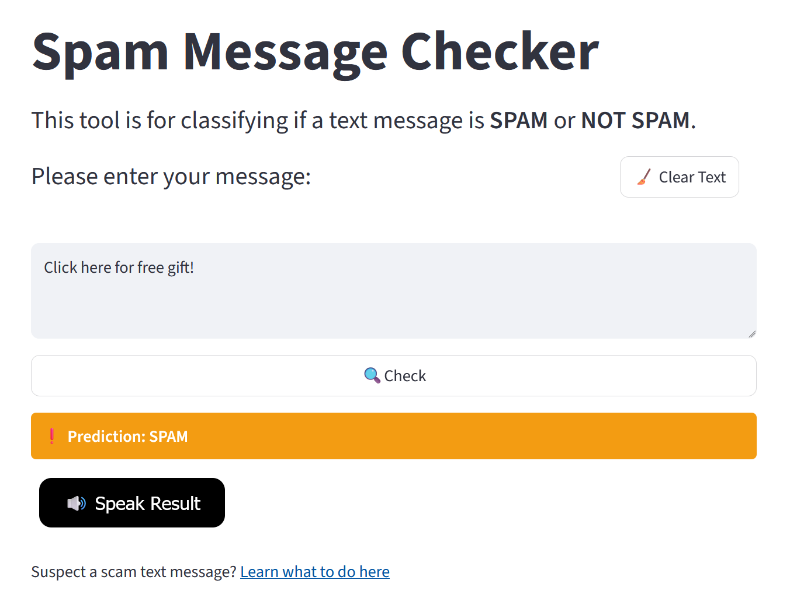
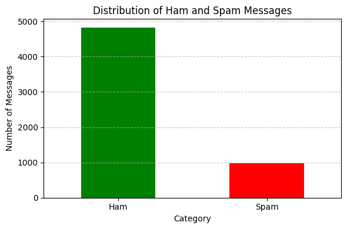

# Accessible Spam Message Classifier

A machine learning–based [SMS spam detection application](https://spammsgcheck.streamlit.app/) that classifies messages as spam or ham (not spam) using **Natural Language Processing (NLP)** and a **Support Vector Machine (SVM)** model, deployed via Streamlit with text-to-speech output for accessibility.

*Please click [here](https://youtu.be/EwgdOBuiui4) for video demo.*

---

## Highlights
- *End-to-end* workflow from preprocessing to deployment.
- **TF-IDF vectorization** for text feature extraction.
- **SVM classifier** optimized and stratifying train-test split for imbalanced data.
- Exported model and vectorizer for reproducible inference (joblib).
- [Streamlit application](https://spammsgcheck.streamlit.app/) with accessible user interaction and audio output.

---

## Skills Demonstrated
✔ **NLP** and **Feature Engineering**

✔ **Supervised Machine Learning (SVM)**

✔ Model Evaluation and Metric Selection

✔ Imbalanced Classification Strategies

✔ Model Serialization and Deployment

✔ Streamlit Application Development

✔ Accessibility-Aware UX Design (Text-to-Speech)

---

## Problem Statement
Spam messages can pose significant risks such as phishing, scams, and misinformation, which disproportionately affect vulnerable groups. This [application](https://spammsgcheck.streamlit.app/) aims not only to detect spam accurately but also to present the results in a clear, accessible way — including the option for the outcome to be read aloud, ensuring that users with limited vision or reading ability can easily understand the classification result.

---

## Project Overview

> **Note:**  
> *This Streamlit application is hosted on the free Tier of Streamlit Community Cloud. If the app has been idle for more than 12 hours, it may take some time to reactivate. In such cases, please click the button saying “Yes, get this app back up!” to relaunch the application. Thank you for your patience.*

This project focuses on building an accessible SMS spam detection tool.

- Applies robust natural language processing (NLP) techniques for message cleaning and linguistic normalization.
- Incorporates TF-IDF vector-based feature representations suitable for linear classification.
- Employs a Support Vector Machine classifier optimized for imbalanced classification performance.
- Prioritizes F1 score and predictive reliability over simple accuracy due to inherent class skew in spam datasets.
- Includes serialized model artifacts (classifier + vectorizer) for reproducible inference.
- Provides an intuitive browser-based interface implemented in Streamlit.
- Supports auditory output for accessibility, enabling predictions to be spoken directly in the browser.
- Offers user guidance for identifying and reporting suspicious SMS messages.

#### Class Imbalance of the Dataset:

---

## Key Technical Decisions
The following design choices were made to address *data imbalance*, optimize feature representation, and ensure deployability:
- Chose TF-IDF over count vectors due to sparse representation advantages.
- Selected SVM as classifier due to better margin performance on sparse text data.
- Used stratified train-test split and F1 score (balancing precision and recall for the minority spam class) to address class imbalance.

---

## Key Insights & Impacts
- Reduces user exposure to fraudulent SMS content by providing fast and automated classification.
- *Text-to-speech* functionality improves accessibility for populations such as older adults and individuals with visual impairments.
- Provides instant and interpretable feedback, increasing user awareness of spam indicators and digital communication safety.
- Guidance on how to handle suspicious text messages, with links to the relevant government resources.

---

## Results Summary

The spam detection model was evaluated on a held-out test dataset.

**Model Configuration**
- Classifier: Support Vector Machine (SVM)
- Feature Extraction: TF-IDF

**Performance Metrics**
- **Primary F1 Score: 0.92 (test set)**

**Confusion Matrix**
|               | Predicted: Ham | Predicted: Spam |
|---------------|----------------|-----------------|
| Actual: Ham   | 897            | 7               |
| Actual: Spam  | 16             | 133             |

**Classification Report (Weighted Averages)**
- Precision: 0.98
- Recall: 0.98
- F1 Score: 0.98

> *Notes:
> Results reflect evaluation on a static [dataset](https://www.google.com/url?q=https%3A%2F%2Fwww.kaggle.com%2Fdatasets%2Fuciml%2Fsms-spam-collection-dataset%3Fresource%3Ddownload)). Real-world performance may vary depending on the nature of user-provided input.*

---

## Stages of Development
The project was developed in sequential stages, spanning dataset preparation, model building, and application deployment:

1. **Data Acquisition and Exploratory Analysis**: Collected a labeled SMS dataset for binary spam classification. Performed exploratory analysis to understand class distribution and linguistic patterns.

2. **Text Preprocessing Pipeline Construction**: Designed a reproducible preprocessing pipeline for message normalization and token cleaning. This included user and URL removal, case folding, non-alphabet filtering, stopword removal, and lemmatization, as later implemented in the application functions

3. **Feature Engineering Using TF-IDF Vectorization**: Utilized a TF-IDF vectorizer to transform normalized text into sparse feature vectors suitable for linear classifiers. The trained vectorizer was serialized as tfidf_vectorizer.pkl for inference alignment with the application code.

4. **Model Training and Selection**: Trained a Support Vector Machine (SVM) classifier for binary categorization of messages as spam or not spam.

5. **User Interface Development**: Developed an interactive UI using Streamlit, enabling message input, classification, and feedback display. Additional features include text-to-speech output, user warnings, and contextual user guidance (e.g., scam reporting links).

6. **Deployment and Runtime Optimization**: Packaged the model, vectorizer, and NLTK assets to support reproducible execution in hosted environments. Added dynamic NLTK download handling and local asset paths to support deployment under Streamlit Cloud constraints.

---

## Technologies Used
- **Scikit-Learn**
- **NLTK**
- **Joblib**
- **Pandas**
- **Matplotlib**
- **Streamlit**

---

## Author
Carmen Wong
